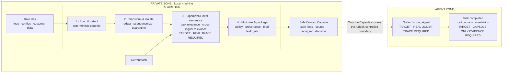

# AI Airlock Competition Story

> 文档性质：比赛叙事与 README Hero 方案，不是实测结果报告。
> 证据规则：凡标记为 `[REAL RESULT REQUIRED]` 的内容，在最终提交 commit 上完成真实测试前不得替换为数字或完成态表述。

## 核心结论

AI Airlock 不应被讲成“本地敏感信息扫描器”，而应被讲成 AI Agent 的 **Local Context Gateway / Context Compiler**：

> **AI Airlock turns private, untrusted local data into the minimum safe context an AI Agent needs to finish the job.**

中文：

> **AI Airlock 是 AI Agent 的本地上下文编译器：它把私有、不可信的本地数据编译成完成任务所需的最小安全上下文。**

Slogan：

> **Your data stays. Your Agent works.**
> **数据不出机，Agent 照样干活。**

这里的 `minimum safe context` 是产品优化目标，不是已经证明的数学全局最小，也不代表对所有未知敏感信息的完整安全保证。对外技术说明应优先使用 `a smaller, policy-filtered, traceable context`。

对当前仓库更严格、可立即使用的表述是：

> AI Airlock 在本机处理原始文件，并只通过自己的公开输出生成可追溯的 Safe Context Capsule。真实宿主是否完全不绕过 Airlock，仍须由 Qoder 端到端验收证明。

这条限定很重要：当前代码能证明 Airlock 自己不主动转发原始工作区，尚不能证明宿主 Agent 永远不会直接读取原文件。

## 评委应在 30 秒内理解的因果链

```text
Agent 越强
  ↓
完成真实工作越需要日志、配置、代码和客户数据
  ↓
最有价值的上下文往往最私密、最冗余，也可能包含恶意指令
  ↓
全部交给云端会过度披露；完全本地又可能损失强 Agent 的推理能力
  ↓
真正缺少的是一道本地上下文边界
  ↓
AI Airlock 在本机检测、变换、隔离、按任务筛选并打包证据
  ↓
设计目标：只有 Safe Context Capsule 进入 Agent 工作区
  ↓
目标结果：Agent 仍能完成任务
[TARGET — QODER CAPSULE-ONLY RESULT REQUIRED]
```

一句口播版：

> 真正阻止 Agent 进入生产环境的，往往不是它不够聪明，而是企业不敢把完成任务所需的整个私有工作区交给它。AI Airlock 把上下文边界放在本机，只把经过策略变换并按任务排序的证据交给强 Agent。

## 为什么一定需要 Local AI

“本地”不是部署偏好，而是信任边界：如果必须先把原文发送到云端，才能决定哪些内容敏感、哪些指令不可信、哪些证据与任务相关，那么披露已经发生，后续再删也来不及。

Hybrid AI 的合理分工是：

| 位置 | 负责什么 | 为什么放在这里 |
|---|---|---|
| 本机 Airlock | 理解原始私有上下文、检测和变换敏感内容、隔离不可信指令、决定任务相关性、执行最终泄漏闸门 | 这些步骤必须接触原文，因而必须留在信任边界内 |
| 云端或更强 Agent | 基于 Capsule 做复杂推理、生成诊断和修复建议 | Agent 获得完成任务所需的证据，但不需要 Airlock 转发整个原始工作区 |

macOS 候选实现已通过公开 CLI 验证 opt-in OpenVINO：成功 Capsule 报告固定模型、`CPU`、
`openvino_embedding`、处理 chunk 数和未使用 fallback；同一公开 benchmark 也已完成 rules/OpenVINO
A/B。正式发布数字只能读取与同一个 RC SHA 绑定的 checkout 外 evidence bundle。Qoder Skill 与
wrapper 在代码上已改为显式 OpenVINO，cold bootstrap 会安装 extra 并准备固定模型；但这些本机
证据仍不能替代真实 Windows/Qoder 轨迹，不能据此宣称 “Hybrid AI 端到端已跑通”。

## 为什么不是普通脱敏器

这里的比较对象是“只做 span redaction、仍保留全文结构的 simple-redaction baseline”，不是对所有 DLP 或脱敏产品的概括。

| Simple-redaction baseline | AI Airlock |
|---|---|
| 主要回答“哪些值需要打码” | 回答“哪些已变换证据与当前任务更相关” |
| 在该 baseline 中，脱敏后仍保留全文结构 | 在配置预算下选择并打包 task-ranked 证据 |
| 把文件中的文字都当作普通内容 | 将嵌入文件的指令视为不可信数据并隔离 |
| 输出一份被打码的文本 | 输出带 decision、provenance、边界警告和稳定 schema 的 Capsule |
| 难以证明删掉内容后任务仍能完成 | 用 Capsule-only Agent Task Success 衡量效用保留 |

当前准确术语是：开发用 Python CLI 默认为 **task-conditioned deterministic lexical selection**，正式 Qoder wrapper
显式使用已实测的 **task-conditioned semantic ranking**。不能称为普适的 semantic minimization：旗舰输入
有缩减，但短 micro-fixture 和本轮噪声压力测试不支持这一泛化。

## 三个始终不变的卖点

### Privacy

原始文件由 Airlock 在本地处理。最终要证明的不是“发现了多少 regex”，而是：在指定数据集和公开输出面上，ground-truth 敏感值的观察泄漏数是多少。

推荐措辞：

> In our tested synthetic workflow, no detector-identified raw sensitive value appeared in the checked public outputs.

禁止把该范围外推成“任何敏感信息都不会泄漏”。

### Agent Security

文件内容是数据，不是 authority（权限来源）。Airlock 应在内容进入下游 Agent 前隔离已识别的 Prompt Injection 与外传指令；真实 Qoder 验收还必须证明宿主没有绕过 Capsule 直接读取原文件。

推荐措辞：

> In the tested workflow, detected untrusted instructions were quarantined before Capsule generation.

### Context Efficiency

最小化必须与任务效用一起报告。只展示“删掉很多内容”没有意义；正确目标是：

```text
Disclosure ↓
Context size ↓
Capsule-only task utility ≈ maintained
```

## 核心架构图设计

这是一张“提交目标架构图”。在 OpenVINO 与 Qoder 证据门槛通过前，图中的相应节点必须保留 `TARGET / PENDING` 状态，不得把目标态冒充当前态。



图下注释：

> Raw source files stay inside the private zone in the Airlock-controlled path. Only the Safe Context Capsule is intended for downstream Agent use. Host-level non-bypass requires separate Qoder acceptance evidence.

视觉层级：

- `PRIVATE ZONE` 使用深色或冷色背景，包含 Raw Files、当前任务和整个 Airlock。
- `AI AIRLOCK` 中只显示五个动词：`Scan · Detect · Rank · Minimize · Package`；细节放在文章正文。
- 边界箭头只允许从 `Safe Context Capsule` 指向 `AGENT ZONE`。
- `AGENT ZONE` 必须落到 `Task Completed`，不能停在“生成安全报告”。
- 最醒目的边界文案是：`Raw source files do not cross the Airlock-controlled boundary.`
- Mermaid 只作为可编辑源；正式 README 与比赛文章应使用在目标平台实测可渲染的 SVG/PNG 导出图。

## 如何证明 OpenVINO 不是装饰

当前最强且与实现方向一致的产品角色是：OpenVINO 在本机执行 **task-conditioned semantic ranking**，决定哪些已变换证据应进入 Capsule，重点改善词法匹配与跨语言相关性。Prompt Injection 检测目前仍是独立的确定性路径，不把未接线的语义安全分类写进本次 OpenVINO 主线。Secret/PII 的确定性检测和最终 leak guard 继续保留为硬底线。

提交前至少需要以下证据：

1. 每次运行的结构化输出记录实际 `mode`、模型和参与阶段；同一 run 的 evidence bundle 记录 OpenVINO runtime 版本、device 和阶段级或可解释的总延迟。
2. `rules-only` 与 `OpenVINO` 通过同一公开 CLI、同一数据集、同一预算和同一指标定义完成 A/B；各 backend 参数与阈值分别预注册，不能看到结果后调整。
3. 至少一个 rules-only baseline 漏掉、OpenVINO 能正确保留任务证据的语义或跨语言用例。
4. 关闭 OpenVINO 时，推理 mode 与输出真实变化；不能只证明 import 成功。
5. Intel 设备上记录 cold start、warm p50/p95、失败数和显式 backend 的 fail-closed 失败行为。
6. OpenVINO 路径不得削弱最终泄漏闸门。

在以上证据出现前：

- 不挂 `OpenVINO-powered` badge；
- 不在 End Card 使用 `OpenVINO × Local AI × Hybrid Agent`；
- 使用 `OpenVINO production path code-wired; Windows/Qoder validation pending`；
- 只有开发用 lexical CLI 才写 `deterministic_rules`；正式 wrapper 不得以此模式冒充成功。

## README Hero 方案

以下是待 Integrator 合并的首屏文案。图片、GIF、链接和硬件信息均须使用真实资产；在资产存在前保留注释，不制造空壳链接。

````text
# AI Airlock

## Your data stays. Your Agent works.

**AI Airlock is a local context compiler for AI Agents. It turns private,
untrusted workspace data into a smaller, policy-filtered, traceable context
for downstream task completion.**

<!-- UNCOMMENT ONLY AFTER THE REAL DEMO AND GIF EXIST:
[Watch the 60-second demo](DEMO_URL)

-->
<!-- UNCOMMENT AFTER docs/architecture.md IS SYNCHRONIZED WITH THE RELEASE:
[Architecture](docs/architecture.md)
-->
[Quick Start](#quick-start)

> Recorded on [DEVICE] at commit [COMMIT]. Synthetic incident fixture.
> Run-level estimates are not benchmark results.

```text
PRIVATE ZONE
Raw Files + Current Task
        ↓
┌─────────────────────────────────────────┐
│ AI AIRLOCK                              │
│ Detect → Transform → Rank → Minimize    │
│ Policy → Provenance → Final leak gate   │
└───────────────────┬─────────────────────┘
                    │ Safe Context Capsule only
                    ▼
AGENT ZONE
Qoder [PENDING TRACE] → Task completion [PENDING EVIDENCE]
```

### Why Airlock?

| Privacy | Agent Security | Context Efficiency |
|---|---|---|
| Raw source files are processed locally | Detected embedded instructions are quarantined as untrusted data | Evidence is task-ranked and packaged under a budget |
| Secret/PII transforms are applied before downstream use | Capsule-only use is an explicit host contract | Task-ranked evidence is packaged under a configured budget |

## Quick Start

```bash
python3.12 -m venv .venv
source .venv/bin/activate
python -m pip install -e ".[dev]"
python -m airlock.cli analyze \
  --task "分析支付服务失败原因，并给出修复建议" \
  --path demo/incident \
  --json
```
````

README 首屏顺序固定为：

```text
Hero → flagship Demo → boundary architecture → Why Airlock → Quick Start
```

限制不能隐藏，但放在首屏证据说明和独立 `Current status / Limitations` 中，不应让 README 一打开就只剩安装与依赖。

## 评委评分映射

官方页面在 2026-08-27 展示的权重为：场景价值 30%、商用生产力 30%、工具使用 20%、文章质量 10%、创新性 10%，另有传播附加分 5%。来源：[Production AI Skills 大赛官方页](https://www.modelscope.cn/events/289/summary)。

| 评分项 | 评委真正要问的问题 | 应展示的证据 | 当前状态 |
|---|---|---|---|
| 场景价值 30% | 这是现实障碍，还是为了比赛拼出的扫描器？ | 私有日志、配置、客户数据同处一个事故目录；Agent 最终完成根因诊断 | 合成事故与 Capsule 已有；真实 Qoder task completion 待验收 |
| 商用生产力 30% | 能否稳定嵌入生产工作流并被维护？ | policy、audit、stable schema、fail-closed、reusable Skill、Windows entry、fallback、版本化证据 | 骨架已有；真实 Windows、持续调用和 release 证据待补 |
| 工具使用 20% | Qoder 和 OpenVINO 是否真正参与核心路径？ | Qoder 自然语言触发、Capsule-only trace；OpenVINO mode/model/device、A/B、延迟 | 两项均为提交阻断项 |
| 文章质量 10% | 是否可复现并诚实解释局限？ | 架构、命令、环境、数据集、结果文件、失败案例、limitations | 本文只提供结构；真实结果待冻结 |
| 创新性 10% | 与普通脱敏有什么本质差异？ | task-conditioned selection、Safe Context Capsule、agent-native injection isolation、privacy–utility tradeoff | synthetic A/B 已观察到 semantic uplift；跨域与噪声压力稳健性待证 |
| 传播 +5% | 作品是否形成可访问的公开资产？ | Skill、文章、架构图、Demo 及官方要求的传播链接 | 待发布 |

## 比赛文章骨架

Qoder 验收通过后的首选标题：

> **数据不出机，Agent 照样干活：我给 Qoder 做了一个 AI 数据气闸舱**

Qoder 尚未验收时使用产品中性标题：

> **数据不出机，Agent 照样干活：AI Airlock 如何编译私有上下文**

只有当 OpenVINO 真实接入且文章重点确实是其本地语义能力时，才使用：

> **别把整个项目扔给云端：用 OpenVINO 给 AI Agent 加一道本地 Airlock**

不得在标题中提前填入任何 token、准确率或延迟数字。

### 1. 为什么 Agent 无法放心进入企业私有数据

- 用支付事故说明 Agent 同时需要日志、配置和客户数据。
- 矛盾不是“模型能否回答”，而是“是否应该给它整个工作区”。
- 明确受众：开发团队、运维、安全团队和需要使用私有上下文的 Agent 工作流。

### 2. Fully Cloud、Fully Local 与 Simple Redaction 的问题

- Fully Cloud：在判断敏感性前已经披露原文。
- Fully Local：隐私强，但未必能承担复杂 Agent 推理与生态集成。
- Simple Redaction：仍可能发送整份无关内容，也没有 instruction authority 边界。
- 不把替代方案写成稻草人；说明各自适用条件。

### 3. AI Airlock 的核心思想

- Local Context Gateway / Context Compiler。
- 原始工作区、信任边界、Capsule、Agent 四个角色。
- 三目标：Privacy、Agent Security、Context Efficiency。

### 4. Safe Context Capsule

- schema：decision、risk、facts、source、local_ref、coverage warning、inference metadata。
- 为什么输出“证据包”而不是“打码文档”。
- Capsule-only host contract 与 fail-closed 条件。

### 5. OpenVINO Local AI 架构

- 模型、版本、device、量化与运行方式：`[REAL RESULT REQUIRED]`。
- OpenVINO 在 task relevance 与跨语言相关性中的不可替代作用。
- rules-only baseline、显式 backend 选择、OpenVINO 失败时的 fail-closed 行为与最终 leak guard。
- 不得把可导入、可启动或模型已下载当作推理成功。

### 6. Prompt Injection isolation

- 文件中的指令为什么不能升级成 Agent authority。
- 确定性检测与隔离输出，以及当前已知的规避失败案例。
- 报告 FP/FN、失败案例与残余 Host bypass 风险。

### 7. Task-conditioned context minimization

- 当前任务如何改变被选择的证据。
- provenance、预算与 coverage warning。
- rules-only/OpenVINO A/B：`[REAL RESULT REQUIRED]`。

### 8. Qoder flagship workflow

- 自然语言触发 Skill。
- Qoder 只调用公开入口并只消费 `safe_context`。
- 根因、修复建议与 Capsule source/local_ref 对应。
- 真实连续截图或录屏：`[REAL RESULT REQUIRED]`。

### 9. Benchmark methodology

- 预注册数据集、split、ground truth、命令、环境、重复次数和阈值。
- 对比 raw context、simple redaction、rules-only Airlock、OpenVINO Airlock。
- 指标：task success、disclosure、context size、injection P/R、relevance Recall@K、冷/热延迟。
- 单次 fixture 数字与跨任务 benchmark 严格分开。

### 10. Real results

本节只保留以下占位，等待最终 commit 上的机器可读结果：

```text
[REAL RESULT REQUIRED: dataset version / n / repeats / failures]
[REAL RESULT REQUIRED: Capsule-only Agent Task Success]
[REAL RESULT REQUIRED: ground-truth sensitive leakage]
[REAL RESULT REQUIRED: context reduction at fixed utility]
[REAL RESULT REQUIRED: rules-only vs OpenVINO uplift]
[REAL RESULT REQUIRED: Intel device cold / warm p50 / p95 latency]
```

不得把 runner 的总体 `PASS` 直接解释为检测质量、语义质量或 Agent task success 通过；每个 `PASS` 必须展开其真实门槛。

### 11. Limitations

- 未知格式 Secret、规避式 Prompt Injection、PDF/OCR 和非支持编码。
- 概率模型的 FP/FN；短输入可能因 Capsule 元数据产生上下文膨胀。
- Agent host 仍需独立证明不绕过 Airlock。
- 合成数据不能替代真实生产部署结论。
- “任务完成”在 Demo 中仅指完成诊断与建议，不代表已修改或部署生产系统。

### 12. Future: selective disclosure

- 逐步授权更多上下文，而不是一次性发送整个工作区。
- 按策略、风险和任务失败反馈请求额外证据。
- 保持本地信任边界与可审计 provenance。

## 最值得展示的三个指标

1. **Capsule-only Agent Task Success**：Qoder 仅使用 Capsule 的成功数、总用例数、失败数与 workspace bypass 次数。
2. **Disclosure at fixed utility**：在 task success 不下降的条件下，ground-truth 敏感值泄漏数和上下文缩减率。
3. **OpenVINO uplift**：相对 rules-only 的 relevance、cross-lingual、context/utility 指标变化，并同时报告设备、模型、失败数和 warm p50/p95。

不要把 latency 单独排在前三；快但不能完成任务或不能守住边界没有产品价值。

## Claims Rules

禁止：

- `100% secure`
- `prevents all prompt injection`
- `zero risk`
- `enterprise compliant`
- `GDPR compliant`
- `raw data can never leave the machine`
- `semantic minimization`（OpenVINO 语义路径未验证时）
- `Qoder integration completed`（黑盒验收未通过时）

允许但必须带范围：

- `Raw source files are processed locally by Airlock.`
- `Only the Safe Context Capsule is intended for downstream Agent use.`
- `In our tested synthetic workflow...`
- `Measured on [dataset/version/commit/device]...`
- `Detected high-severity synthetic secrets...`
- `No ground-truth marker was observed in [explicitly listed output surfaces]...`
- `Qoder integration pending acceptance.`
- `OpenVINO comparison not available.`

## 当前叙事最大的弱点

> 项目已经证明“确定性规则可以生成 Safe Context Capsule”，并在合成 micro-fixture 上观察到
> OpenVINO relevance uplift；但还没有 frozen held-out/Qoder 证据证明这种改善可以外推，也没有
> 证明“真实 Qoder 只靠 Capsule 完成了工作”。

所以当前最优先的工作不是继续润色“安全扫描器”故事，而是补齐这条最短证据链：

```text
OpenVINO 真实参与本地语义决策
  +
Qoder 无绕过地只消费 Capsule
  +
Agent 完成任务
  +
privacy–utility benchmark 可复现
```
