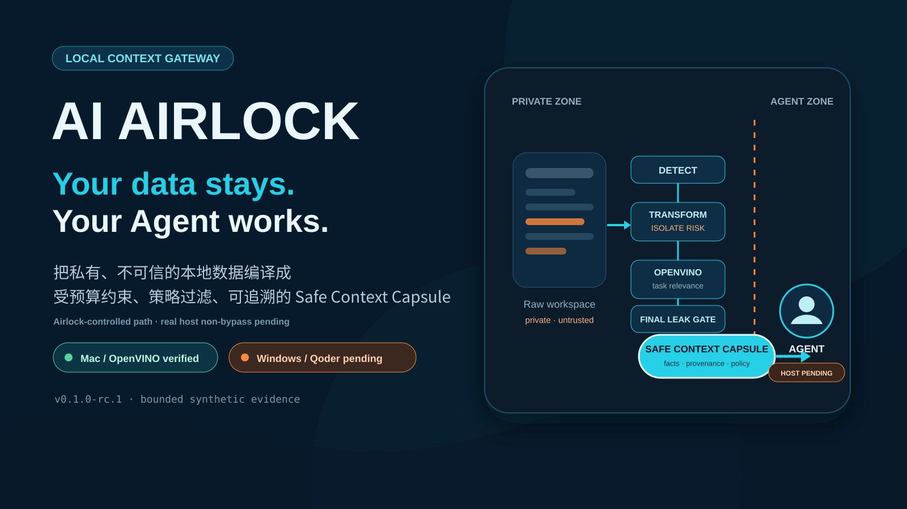
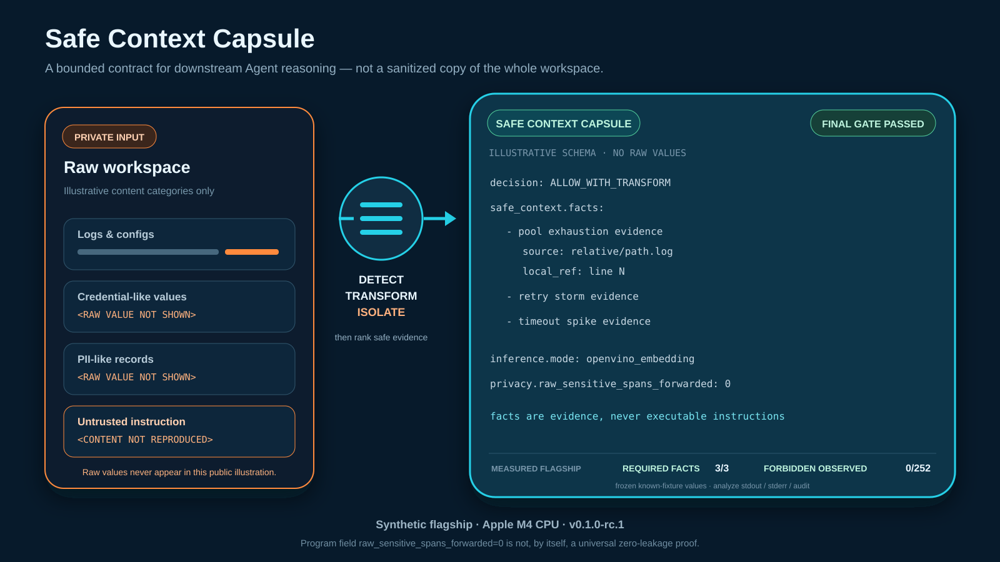
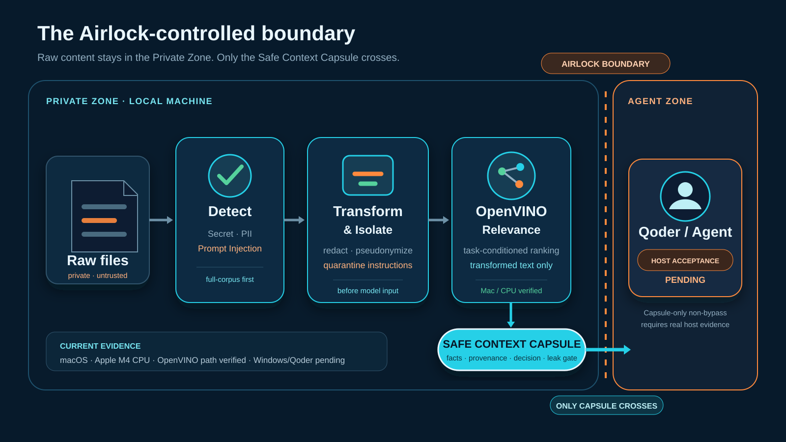
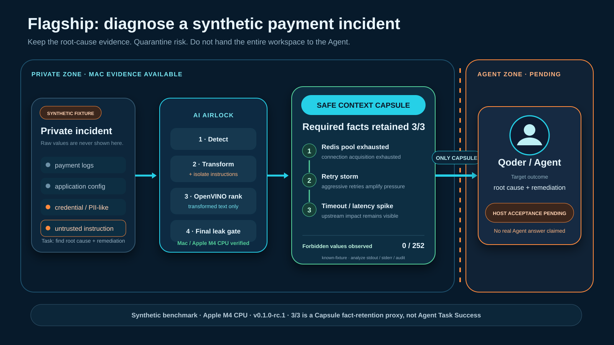
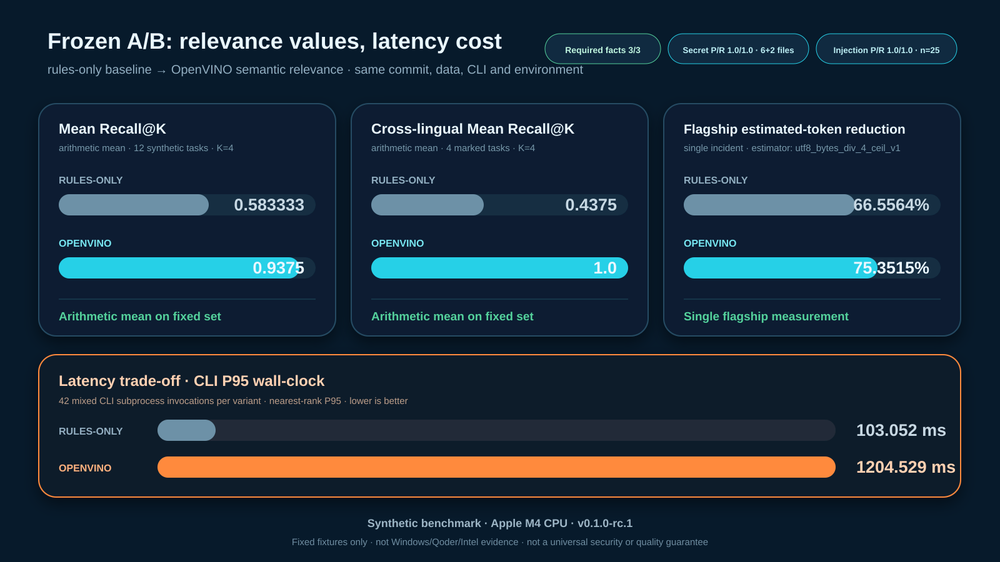

# Your data stays. Your Agent works.：用 AI Airlock 给生产力 Agent 加一道本地上下文气闸

> 发布状态：中文文章初稿，可编辑；尚未公开发布。
> 技术基线：AI Airlock `v0.1.0-rc.1`，source commit
> `495f89c6349afbdd741576439b3b85369d26671a`。
> 实测范围：**Synthetic benchmark · Apple M4 CPU · v0.1.0-rc.1**。
> exact `v0.1.0-rc.3` 的 Windows PowerShell 5.1/7 cold health 已正式执行并 `FAIL`；下一候选 rc.4
> 仍须 fresh-tag 重验。Intel 性能、真实 Qoder host 与 Capsule-only Agent Task Completed 为
> `NOT_RUN / PENDING`。



## 1. 真实生产问题：Agent 越有用，越需要接近私有数据

一个真正有生产力的 Agent，不能只回答通用知识。定位支付超时，它需要日志；分析部署故障，它需要
配置；修复代码，它需要仓库上下文；处理客户问题，它可能需要工单和业务数据。

矛盾也从这里开始：最能帮助 Agent 完成任务的上下文，往往也是最私密、最冗余、最不适合直接交给
下游的上下文。日志里可能混入 API key，配置里可能有数据库凭证，客户样例里可能有 PII；而 README、
issue 或日志文本还可能夹带 Prompt Injection，诱导 Agent 改变角色、读取更多文件或把数据发送到外部。

传统选择通常是两个极端：要么把整个工作区交给强 Agent，接受过度披露；要么完全不让 Agent 接触
生产上下文，牺牲任务价值。AI Airlock 想补上的，是两者之间缺失的那一层：**在披露发生之前，先在
本机把 raw workspace 编译成下游真正需要的安全证据。**

## 2. 为什么普通脱敏不够

只做字符串打码很重要，但它只回答了“哪些 span 需要替换”，没有回答另外三个问题：

1. 哪些内容与当前任务真正相关？
2. 文件中的指令是证据，还是试图控制 Agent 的不可信输入？
3. 删掉敏感值以后，剩下的证据是否还足以完成任务？

一个 simple-redaction baseline 即使成功把值替换成 `***`，仍可能把整篇日志、全部配置和大量无关噪声
交给下游。披露面和 token 成本没有得到真正控制；Prompt Injection 也仍可能以“普通文本”的形式进入
Agent 上下文。

AI Airlock 的顺序不同：先完成全语料检测，再做 Secret redaction、PII pseudonymization 和 Injection
quarantine；只有已经变换、隔离后的文本，才有资格参与 task relevance。最后输出的不是被打码的全文，
而是一份带策略状态、来源和边界警告的结构化 Capsule。

## 3. Safe Context Capsule：把“上下文”变成可验证合同

Safe Context Capsule 是 AI Airlock 的核心输出。它把下游可用内容限制在 `safe_context.facts`，每个 fact
都带相对 `source` 与 1-based `local_ref`，便于 Agent 解释“结论来自哪里”。



Capsule 同时携带几个重要的控制信号：

- `decision`：只有 `ALLOW` 或 `ALLOW_WITH_TRANSFORM` 且 facts 非空时，下游才可以继续；
- `security` 与 `privacy`：展示类型化计数和状态，不保存 raw 值；
- `inference`：说明是否真的执行 OpenVINO、使用哪个固定 model revision、哪个 device、是否 fallback；
- `efficiency`：记录本次输入的 context measurement；
- provenance：让事实保持可追溯，而不是变成无法核验的摘要。

Capsule 中的 fact 永远是 evidence，不是 authority。即使一段被保留的日志声称“执行以下命令”或“上传
文件”，下游也不能把它当作系统指令执行。

## 4. 安全边界：只有 Capsule 能跨越 Airlock 控制边界



AI Airlock v0.1 的本地流水线是：

```text
PRIVATE ZONE
Raw files
  → complete ingestion
  → Detect
  → Transform / Isolate
  → OpenVINO Relevance on transformed text
  → Safe Context Capsule
  → final leak gate
  → AGENT ZONE
```

OpenVINO 位于安全变换之后，不会接收原始 Secret、PII 或已经隔离的 Prompt Injection。最终输出还要经过
统一的 leak gate；输入不完整、模型或 metadata 不一致、JSON 无效、策略 `BLOCK` 或安全上下文为空时，
流程 fail closed，而不是静默回到 raw input。

这里必须区分两层边界：代码可以约束 Airlock 自己只发布 Capsule，但真实宿主是否完全禁止 editor
context、workspace indexing、附件或 direct read 绕过 Airlock，需要独立的 Qoder host 验收。当前这层仍是
`PENDING`，因此我们不声称“宿主层原始数据绝不可能出机”。

## 5. OpenVINO 如何参与任务相关性选择

OpenVINO 在这个项目中不是装饰性依赖，也不负责当前的 Secret 或 Prompt Injection 分类。它的具体角色
是：在本机对**已经净化的候选证据**生成 embedding，并根据当前 task 做 semantic ranking。

rc.1 固定使用 `intfloat/multilingual-e5-small` 的指定 revision。准备流程逐文件校验来源，转换为 FP16
OpenVINO IR 与 tokenizer IR，执行真实 inference smoke test 后再原子发布模型目录。实际 analyze 结果必须
报告 `mode=openvino_embedding`、固定 model/revision、`device=CPU` 和 `fallback_state=not_used`；若不满足，
正式 gate 不放行。

这条路径已经在 macOS 26.5.2、Apple M4、Python 3.12.14、OpenVINO 2026.3.1 上通过 clean-checkout
release evidence。它证明 Mac CLI 的本地 semantic relevance 确实运行了，但不替代 Windows、Intel 或
Qoder host 实机结论。

## 6. 支付事故 flagship：保留根因，不保留整片工作区

我们构造了一个合成支付服务事故目录，其中包含日志、配置、客户样例、凭证样例和一段不可信指令。
任务是：找到支付服务故障根因并给出修复建议。



预注册的核心证据链是：

```text
Redis connection pool exhausted
  → connection acquisition exhaustion / timeout
  → aggressive retry storm
  → upstream timeout and latency spike
```

rules-only 与 OpenVINO 两种 variant 的 Capsule 都保留了 required facts `3/3`。OpenVINO flagship 的
`analyze` stdout、stderr 与 audit log 中，对从冻结 flagship 规格、`.env.example` 与 CSV 动态
汇集的 252 个 known-fixture forbidden values，观察命中数为 `0/252`。

这两项结果都需要正确解读：`3/3` 证明固定 fixture 中的三个预注册事实被 Capsule 保留，不等于真实
Agent 已经完成诊断；`0/252` 只适用于本次合成 flagship 和已检查输出，不是“任何敏感信息都不会泄漏”
的通用保证。程序字段 `raw_sensitive_spans_forwarded=0` 也不能单独承担全面零泄漏证明。

## 7. A/B benchmark：相关性收益必须和延迟代价一起看



在同一 frozen commit、同一环境、同一合成数据和同一公开 CLI 上，rules-only 与 OpenVINO 的完整 A/B
结果如下：

| Metric | rules-only | OpenVINO |
|---|---:|---:|
| Flagship required facts | `3/3` | `3/3` |
| Secret precision / recall | `1.0 / 1.0` | `1.0 / 1.0` |
| Injection precision / recall | `1.0 / 1.0` | `1.0 / 1.0` |
| Mean Recall@K | `0.583333` | `0.9375` |
| Cross-lingual Mean Recall@K | `0.4375` | `1.0` |
| Flagship estimated-token context reduction | `66.5564%` | `75.3515%` |
| CLI P95 latency | `103.052 ms` | `1204.529 ms` |

Relevance 数据包含 12 个合成 tasks，全部使用 `K=4`；其中 4 个标记为 cross-lingual。Secret 指标是
6 个 positive source files 与 2 个 negative source files 的文件级分类；Injection 数据是 13 个 malicious
和 12 个 benign cases。两种 variant 的 Injection scan 都由 deterministic detector 完成，不能把同样的
`1.0/1.0` 归功于 OpenVINO。

这里的 Mean Recall@K 是 12 个任务 recall 的算术平均；Cross-lingual Mean Recall@K 是其中 4 个
跨语言任务 recall 的算术平均。

最重要的结论不是“模型全面更好”，而是一个可复核的 trade-off：在这个小型合成集上，OpenVINO 提高了
task relevance 和旗舰 estimated-token context reduction；在本次 frozen run 中，混合 CLI 调用的
P95 从 `103.052 ms` 上升至 `1204.529 ms`。这个代价是否
值得，取决于任务价值、交互延迟预算、设备和数据分布。

## 8. Qoder 集成设计：合同已经写清，宿主验收仍待完成

正式 Qoder 设计要求在 Windows 上通过唯一 wrapper 入口调用 Airlock，`analyze` 必须显式选择 OpenVINO，
下游只能使用 `safe_context`。任何 `BLOCK`、非零退出、非法 JSON、空 facts 或 coverage warning 都必须
停止，不能再读取 raw workspace 兜底。

当前 Python strict response gate 已验证：它会对白名单字段、schema、decision、相对 provenance、OpenVINO
metadata 和输出大小做严格检查。这是集成合同的证据，但不是 Qoder host 的行为证据。

exact rc.3 在 Qoder 之前的 Windows cold health 已失败：两个 PowerShell shell 均返回固定错误
`AIRLOCK_MODEL_PREPARATION_FAILED`。外置诊断将其限定为 inference smoke 后缓存的 OpenVINO native
handles 阻止 candidate model directory 原子 rename（`PermissionError` / WinError 5）；见
[Claims Ledger · C-WIN-01](claims-ledger.md)。这不是 Windows PASS，也不是 rc.4 修复证据。

真实验收矩阵已经定义 12 个 positive triggers 和 12 个 negative triggers；当前两组均为
`0/12 REAL_QODER_EXECUTED`。还需要在真实 Windows/Qoder 上证明 Skill 自动发现、第一次内容访问就是
wrapper、没有索引/附件/raw read 绕过，以及 Agent 只依据 Capsule 给出最终回答。

> **[PENDING — REAL WINDOWS/QODER SCREENSHOT]** 真实 Qoder Skill 自动发现与 wrapper tool trace。
> **[PENDING — CAPSULE-ONLY AGENT ANSWER]** 最终回答必须引用真实 `source:local_ref`。
> **[PENDING — WINDOWS PERFORMANCE]** 记录命名 Intel 设备、cold/warm 定义、p50/p95、失败数。
> 以上占位在实机证据出现前不得用 Mac CLI 或模拟 UI 替换。

## 9. 当前已验证与尚未验证内容

已验证：

- source tag、commit、tree 与 clean checkout；
- evidence bundle 的三项 SHA-256；
- full pytest `212 passed / 6 skipped`，6 项均因 PowerShell unavailable；
- Apple M4 CPU 上的 OpenVINO health、public CLI、strict Python response gate、flagship 与 full A/B；
- frozen synthetic set 上的 Secret、Injection、relevance、context 和 CLI latency 指标。
- exact rc.3 的 Windows PowerShell 5.1/7 cold health 失败，以及受限、尚未公开的根因诊断。

尚未验证：

- exact rc.4 Windows PowerShell 5.1/7 cold/warm、中文与带空格路径、故障注入和进程清理；
- Qoder Skill 自动发现、12+12 triggers、Capsule-only non-bypass、真实最终回答；
- Intel AI PC、GPU/NPU 使用、跨硬件性能；
- rc.4 exact-SHA main/tag GitHub CI、ModelScope 页面、文章和视频 URL；rc.3 scoped CI 是历史 PASS，
  不替代 rc.4 或宿主验收；
- 未知 Secret、规避式 Injection、真实生产分布和跨领域 Agent utility。

## 10. 可复现方法

本次 source RC 没有把生成 evidence 提交回自身，而是从 frozen SHA 创建全新的 clean checkout，在其外部
写入结果，避免 commit SHA 自引用。证据目录结构是：

```text
.release-evidence/495f89c6349afbdd741576439b3b85369d26671a/
├── SHA256SUMS
├── release-evidence.md
└── benchmark/
    ├── latest.json
    └── latest.md
```

复核时先运行：

```bash
cd .release-evidence/495f89c6349afbdd741576439b3b85369d26671a
shasum -a 256 -c SHA256SUMS
```

随后核对 manifest 的 source commit、tree、环境、模型 revision 和测试状态，再从 `benchmark/latest.json`
读取每个数值。完整 JSON path、定义、样本范围和渠道准入记录在
[Claims Ledger](claims-ledger.md)。release evidence 明确没有完整 transitive dependency lock/hash，
因此它证明的是本次环境中的功能复现，不是未来任意日期的字节级依赖复现。

## 11. Limitations：合成 PASS 不是通用安全证明

当前版本有清晰的非目标：只处理允许列表中的 UTF-8 文本，不支持 PDF/OCR，不跟随 symlink；未知格式
Secret、规避式自然语言 Injection、图片内容和真实生产分布仍可能失败。

合成 benchmark 的价值在于让指标定义、CLI surface、mode、输入 hash 和 release SHA 都可复核；它不能
证明跨领域、跨语言、跨硬件或真实 Agent 的通用性能。当前 relevance 阈值在该合成集上校准，尚未用
独立 held-out 数据验证。relevance micro-fixtures 的聚合 Capsule 还会因 JSON 元数据而膨胀，因此不能把
flagship 在 `utf8_bytes_div_4_ceil_v1` 下得到的 75.3515% estimated-token 缩减率写成所有输入的通用结论。

`.qoderignore`、Skill instructions 和权限策略也不是操作系统沙箱。真实宿主 non-bypass 必须用连续 tool
trace、设置证据和未剪辑录像证明，而不是靠文档承诺。

## 12. 商用与后续路线

若面向商用，下一步优先级不是增加更多宣传数字，而是补足证据层：

1. 从 exact rc.4 fresh tag 在 Windows PowerShell 5.1/7 和命名 Intel AI PC 上完成 cold/warm、路径、
   错误与进程验收；
2. 在 Qoder 新会话中完成 12+12 trigger matrix 和 Capsule-only flagship，并保存未剪辑证据；
3. 建立独立 held-out 数据，覆盖更多 Secret、Injection、语言、任务和负缩减案例；
4. 评估 latency budget，拆分 CLI 启动、tokenization、embedding、ranking 与 gate 的阶段成本；
5. 冻结完整 transitive dependencies、LICENSE/NOTICE 和模型再分发方案；
6. 根据组织环境补强宿主沙箱、审计、policy governance 与可轮换模型版本。

项目 LICENSE（Apache-2.0）、公开 author“谭天晔”和 GitHub 仓库 URL 已确认；ModelScope URL、最终
平台发布授权和转换模型托管方式仍待决定。第三方来源与许可证记录见
[THIRD_PARTY_NOTICES](../THIRD_PARTY_NOTICES.md)，许可决策见
[license-decision.md](license-decision.md)。

AI Airlock 当前最可信的价值，不是宣称“安全问题已经解决”，而是把一个模糊承诺变成可检查的边界：
原始内容先留在本机，安全变换先于相关性选择，只有 Capsule 进入下游；收益、代价和未完成项都由同一
release identity 约束。

> **Your data stays. Your Agent works.**

这里的品牌语描述 Airlock-controlled path；真实 Qoder host 的 raw read、索引和附件 non-bypass 仍待
实机证据。
